<div align="center">

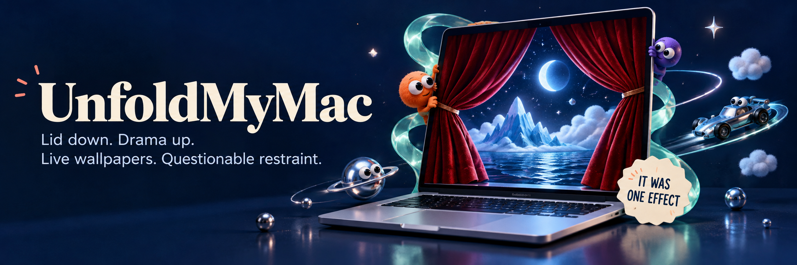

# UnfoldMyMac

Desktop effects that follow your lid. Live wallpapers with something going on.

<p>
  <a href="#get-started"></a>
  <a href="MacDuo/Package.swift"></a>
  <a href="#the-effects"></a>
  <a href="LICENSE"></a>
</p>
<p>
  <a href="https://forthebadge.com"></a>
  <a href="https://forthebadge.com"></a>
  <a href="https://forthebadge.com"></a>
  <a href="https://forthebadge.com"></a>
</p>
<p>
  <a href="#how-it-started"></a>
  <a href="#the-effects"></a>
</p>
<p>
  <a href="MacDuo/Package.swift"></a>
  <a href="#contributing"></a>
  <a href="https://github.com/satyajiit/UnfoldMyMac"></a>
  <a href="https://matterwardlabs.com"></a>
</p>

[Real-life films](#filmed-on-a-real-macbook) · [Effects](#the-effects) · [Live wallpapers](#living-wallpapers) · [The story](#how-it-started) · [Native stack](#native-down-to-the-pixels) · [Get started](#get-started)

From [Matterward Labs](https://matterwardlabs.com).

</div>

Close your MacBook and curtains meet across the desktop. Open it and they pull apart. Or choose blur, glowing ribbons, blinking characters, and artwork that opens with the lid.

Leave the laptop open and the wallpapers take over: a chrome sculpture reacts to system load, a robot follows coding activity, and your public GitHub profile becomes a small city. All native SwiftUI, AppKit, and Metal.

## Filmed on a real MacBook

A café table. A moving lid. A desktop with a little character. These real-life films sit alongside the full rendered preview collection below.

<p align="center">
  <a href="https://youtu.be/3wAaLwu-msc">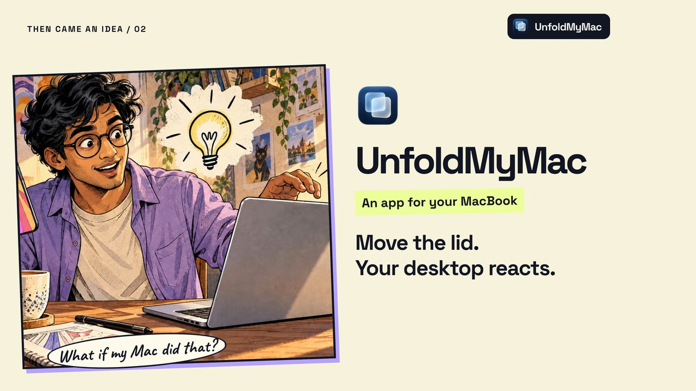</a><br>
  <strong>Give Your Mac a New Look.</strong> · 2 min 30 sec · 4K / 60 fps · HDR on YouTube<br>
  <a href="https://youtu.be/3wAaLwu-msc">Watch on YouTube ↗</a> · <a href="https://unfoldmymac.com/showcase/#real-reel">View on the website</a>
</p>

<table>
  <tr>
    <td width="50%" align="center"><a href="https://www.youtube.com/watch?v=uXgEo_o9gIg">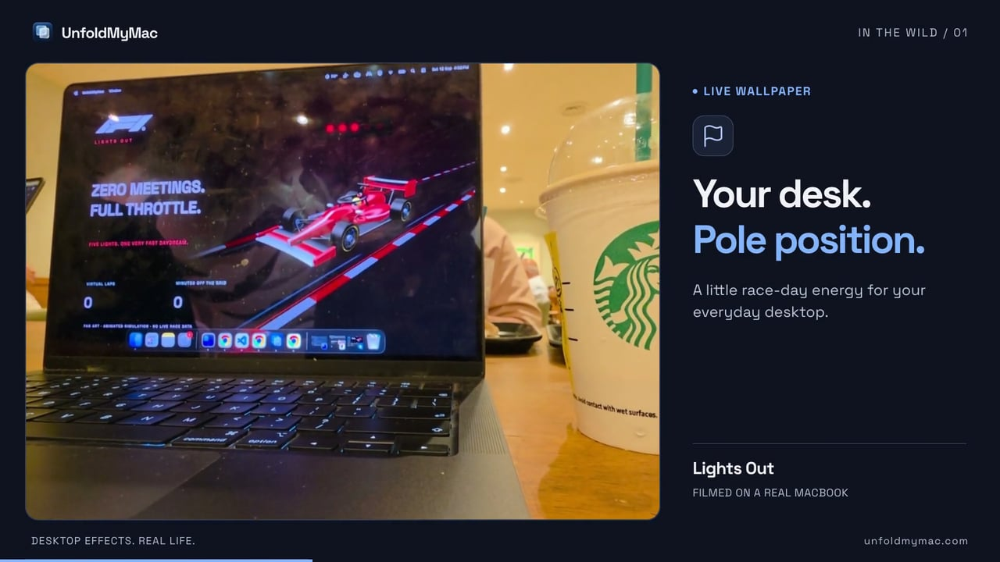</a><br><strong>Lights Out</strong><br><sub>A race circuit on the desktop.</sub><br><a href="https://www.youtube.com/watch?v=uXgEo_o9gIg">Watch on YouTube · 14.7s</a> · <a href="https://unfoldmymac.com/showcase/#real-lights-out">Website</a></td>
    <td width="50%" align="center"><a href="https://www.youtube.com/watch?v=K8EdaVhhuBc">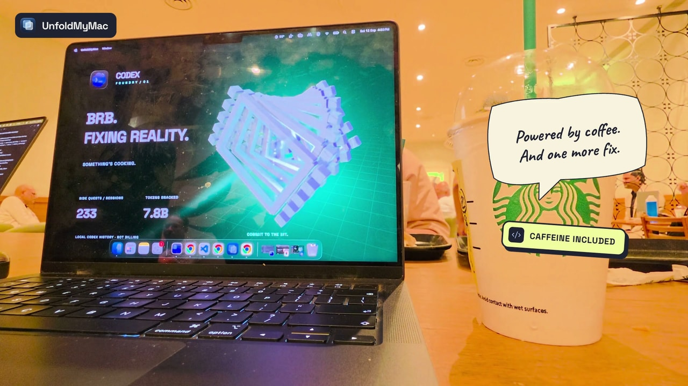</a><br><strong>Codex Foundry</strong><br><sub>Local Codex activity powers a tiny factory.</sub><br><a href="https://www.youtube.com/watch?v=K8EdaVhhuBc">Watch on YouTube · 21.9s</a> · <a href="https://unfoldmymac.com/showcase/#real-codex-foundry">Website</a></td>
  </tr>
  <tr>
    <td width="50%" align="center"><a href="https://www.youtube.com/watch?v=nDbIJivsbAc">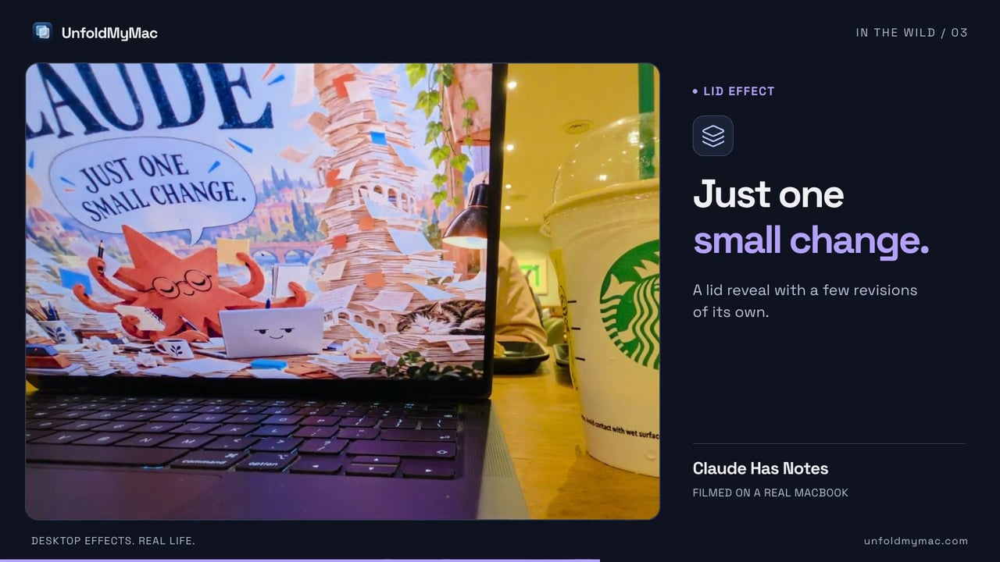</a><br><strong>Claude Has Notes</strong><br><sub>Claude takes over as the lid closes.</sub><br><a href="https://www.youtube.com/watch?v=nDbIJivsbAc">Watch on YouTube · 10.5s</a> · <a href="https://unfoldmymac.com/showcase/#real-claude-has-notes">Website</a></td>
    <td width="50%" align="center"><a href="https://www.youtube.com/watch?v=23SEy6OLJyg">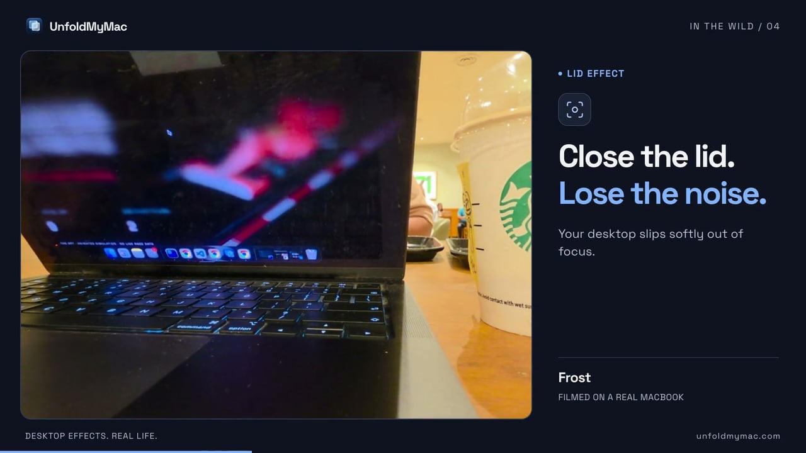</a><br><strong>Frost</strong><br><sub>Lid angle controls the blur.</sub><br><a href="https://www.youtube.com/watch?v=23SEy6OLJyg">Watch on YouTube · 18.3s</a> · <a href="https://unfoldmymac.com/showcase/#real-frost">Website</a></td>
  </tr>
  <tr>
    <td colspan="2" align="center"><a href="https://www.youtube.com/watch?v=RdcjgygF0Vg">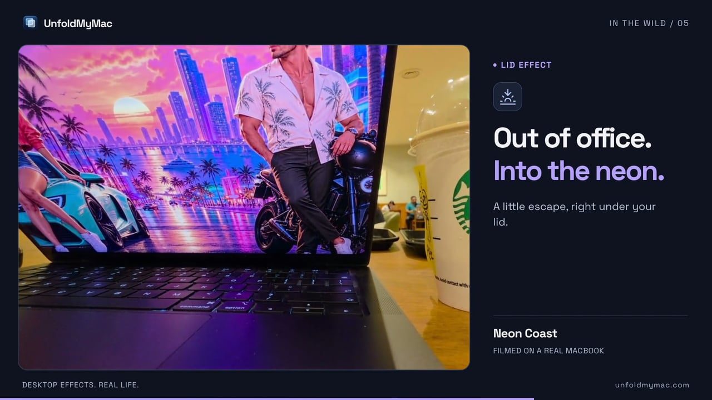</a><br><strong>Neon Coast</strong><br><sub>Artwork revealed by the lid.</sub><br><a href="https://www.youtube.com/watch?v=RdcjgygF0Vg">Watch on YouTube · 20.5s</a> · <a href="https://unfoldmymac.com/showcase/#real-neon-coast">Website</a></td>
  </tr>
</table>

UnfoldMyMac makes your desktop react when you move your MacBook’s lid, and adds live wallpapers behind your windows. Start with the **00:00 origin and app introduction**, explore the **00:44 collection**, then watch the **01:22 café recordings at 1.5×**. All 23 templates appear in three scenes: an overview mosaic, a moving grid of 13 effects, and a moving grid of 10 wallpapers. [Browse every scene in the interactive carousel ↗](https://unfoldmymac.com/showcase/#every-preview)

All five recordings play from beginning to end: **1.5× in the full film**, **original speed in the individual clips**. Each has a one-second transition before and after. All six films include a spoken voiceover, an original funk score, and a 4K 60 fps HDR upload on YouTube. The playful coffee bubbles, icon stickers, and UnfoldMyMac badge are back; large caption panels stay off the footage. Press play on the website to watch with sound. The complete effects and wallpaper collection follows.

## The effects

All 13 effects, shown over a macOS demo desktop with a menu bar, Dock, and sample windows. The animations use the app's actual Metal and AppKit renderers.

### Glass & Light

<table>
  <tr>
    <td width="50%" align="center">
      <a href=".github/media/effects/frost.gif"></a><br>
      <strong>Frost</strong><br><sub>The original iPhone Duo-inspired effect. A soft blur deepens toward the top of your desktop.</sub>
    </td>
    <td width="50%" align="center">
      <a href=".github/media/effects/veil.gif"></a><br>
      <strong>Veil</strong><br><sub>Native translucent glass with a quiet tint. No Screen Recording needed.</sub>
    </td>
  </tr>
  <tr>
    <td colspan="2" align="center">
      <a href=".github/media/effects/fade.gif">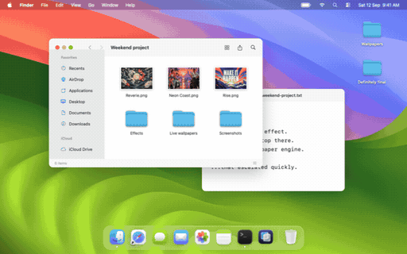</a><br>
      <strong>Fade</strong><br><sub>A smooth shade follows the lid into darkness. Your tabs can rest now.</sub>
    </td>
  </tr>
</table>

### Motion & image reveals

<table>
  <tr>
    <td width="50%" align="center">
      <a href=".github/media/effects/curtains.gif">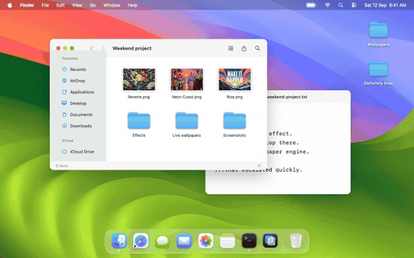</a><br>
      <strong>Curtains</strong><br><sub>Velvet folds, stage lighting, and a curtain call for your tabs.</sub>
    </td>
    <td width="50%" align="center">
      <a href=".github/media/effects/current.gif">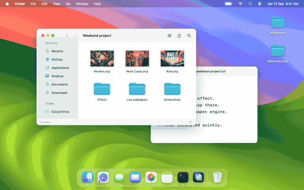</a><br>
      <strong>Current</strong><br><sub>Mint and coral ribbons that keep moving while the lid holds still.</sub>
    </td>
  </tr>
  <tr>
    <td width="50%" align="center">
      <a href=".github/media/effects/peekaboo.gif">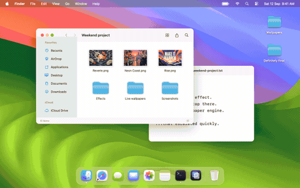</a><br>
      <strong>Peekaboo</strong><br><sub>Blinking characters. Your desktop has acquired witnesses.</sub>
    </td>
    <td width="50%" align="center">
      <a href=".github/media/effects/reverie.gif">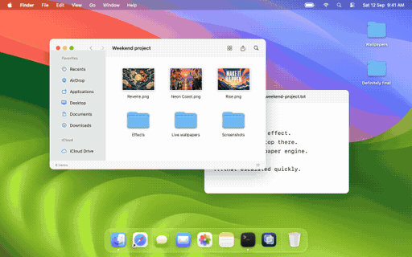</a><br>
      <strong>Reverie</strong><br><sub>Celestial paper art opens along a curved, moonlit seam.</sub>
    </td>
  </tr>
  <tr>
    <td width="50%" align="center">
      <a href=".github/media/effects/neon-coast.gif"></a><br>
      <strong>Neon Coast</strong><br><sub>A neon coastline separates into angled panels.</sub>
    </td>
    <td width="50%" align="center">
      <a href=".github/media/effects/tab-goblin.gif"></a><br>
      <strong>Tab Goblin</strong><br><sub>Bro. Close a tab. The laptop has a point.</sub>
    </td>
  </tr>
</table>

<details>
<summary><strong>Four more image reveals, including FCUK It. Ship It.</strong></summary>

<table>
  <tr>
    <td width="50%" align="center">
      <a href=".github/media/effects/rise.gif"></a><br>
      <strong>Rise</strong><br><sub>MAKE IT HAPPEN. With cobalt steps and a sunburst.</sub>
    </td>
    <td width="50%" align="center">
      <a href=".github/media/effects/fcuk-it.gif"></a><br>
      <strong>FCUK It. Ship It.</strong><br><sub>An orange-and-cobalt answer to one more round of tweaking.</sub>
    </td>
  </tr>
  <tr>
    <td width="50%" align="center">
      <a href=".github/media/effects/codex-after-dark.gif">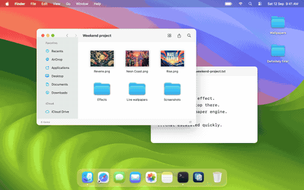</a><br>
      <strong>Codex After Dark</strong><br><sub>One more fix. A midnight pixel-art bug chase.</sub>
    </td>
    <td width="50%" align="center">
      <a href=".github/media/effects/claude-has-notes.gif"></a><br>
      <strong>Claude Has Notes</strong><br><sub>Just one small change. The revision pile disagrees.</sub>
    </td>
  </tr>
</table>

</details>

- **Add your own image.** Choose Sculpted, Diagonal, Slide, or Burst, then adjust depth and edge light. The app keeps a local copy.
- **Set the timing.** Pick the starting lid angle and how far into closing the effect should finish. Preview supports play, pause, and scrubbing.
- **Keep control.** Effects start disabled. Overlays let clicks through; the Dock and menu-bar controls stay available.
- **Use your system preferences.** Reduce Motion stills continuous animation. Reduce Transparency uses dimming without screen capture.

## Living wallpapers

Ten scenes, optional personal data connections, and 30 or 60 fps playback across your displays. Choose a scene, try its preview, then select **Use wallpaper**.

The GIFs below use the app's Metal shaders and SwiftUI text layers with **sample data**. They are exported at 12 fps to keep the README lighter.

<table>
  <tr>
    <td width="50%" align="center">
      <a href=".github/media/wallpapers/pulse.gif">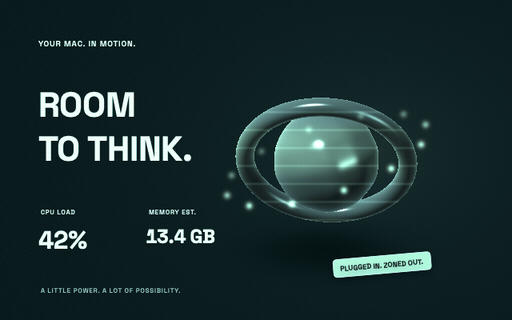</a><br>
      <strong>Pulse</strong><br><sub>CPU load, memory, and battery feed a moving chrome sculpture.</sub>
    </td>
    <td width="50%" align="center">
      <a href=".github/media/wallpapers/daydream.gif">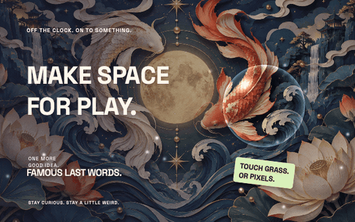</a><br>
      <strong>Daydream</strong><br><sub>Your image, floating glass, and a sticker with opinions.</sub>
    </td>
  </tr>
  <tr>
    <td width="50%" align="center">
      <a href=".github/media/wallpapers/claude-current.gif">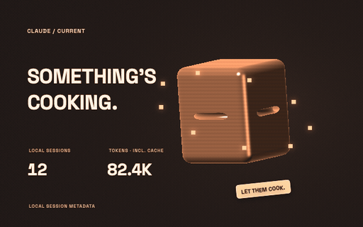</a><br>
      <strong>Claude Current</strong><br><sub>Local Claude sessions and token counts bring the scene to life.</sub>
    </td>
    <td width="50%" align="center">
      <a href=".github/media/wallpapers/codex-foundry.gif">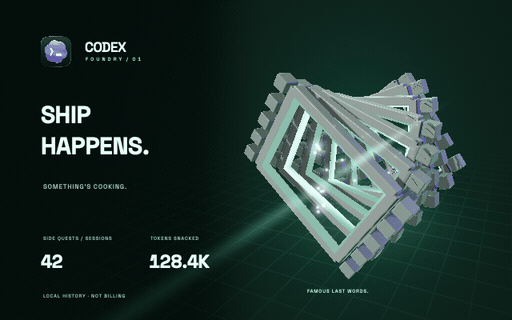</a><br>
      <strong>Codex Foundry</strong><br><sub>A 3D accelerator assembles around local Codex activity.</sub>
    </td>
  </tr>
  <tr>
    <td width="50%" align="center">
      <a href=".github/media/wallpapers/codex-mission-control.gif">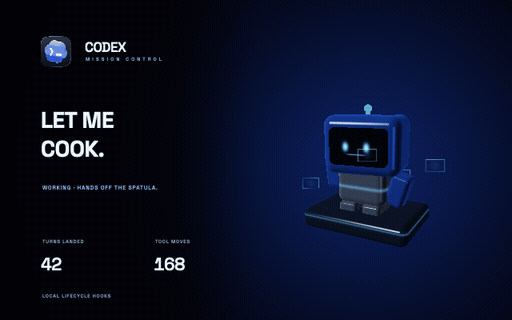</a><br>
      <strong>Codex Mission Control</strong><br><sub>A little robot responds to working, waiting, and completed hook states.</sub>
    </td>
    <td width="50%" align="center">
      <a href=".github/media/wallpapers/grok-horizon.gif">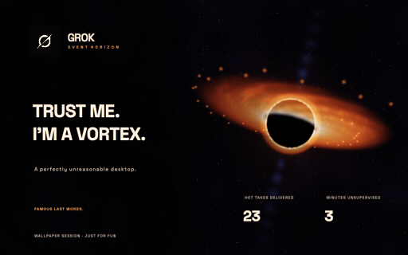</a><br>
      <strong>Grok Event Horizon</strong><br><sub>A black hole with playful session counters. No chill detected.</sub>
    </td>
  </tr>
  <tr>
    <td width="50%" align="center">
      <a href=".github/media/wallpapers/github-after-hours.gif">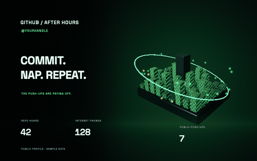</a><br>
      <strong>GitHub After Hours</strong><br><sub>Public repositories, followers, and push events become a floating city.</sub>
    </td>
    <td width="50%" align="center">
      <a href=".github/media/wallpapers/lights-out.gif">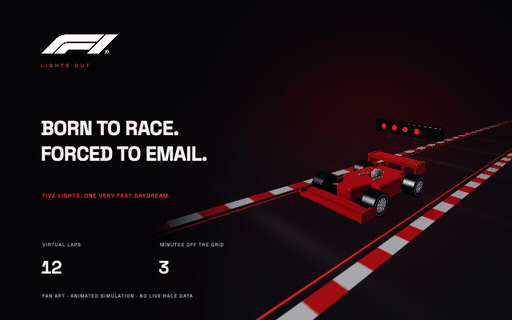</a><br>
      <strong>Lights Out</strong><br><sub>An open-wheel car, a flowing circuit, and a five-light countdown.</sub>
    </td>
  </tr>
  <tr>
    <td width="50%" align="center">
      <a href=".github/media/wallpapers/gta-vi-countdown.gif">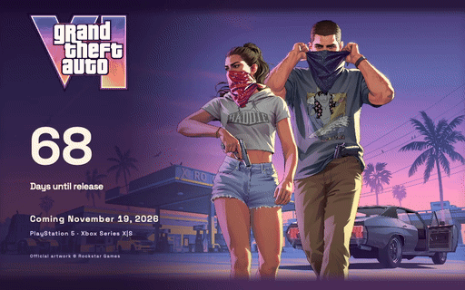</a><br>
      <strong>GTA VI — Vice City Countdown</strong><br><sub>Rockstar's own promotional artwork and a calendar-day countdown to the announced console release. Artwork © Rockstar Games, excluded from this project's licence; not affiliated with or endorsed by Rockstar Games or Take-Two. Rights holders: <a href="mailto:admin@matterwardlabs.com">admin@matterwardlabs.com</a>. See <a href="NOTICE">NOTICE</a>.</sub>
    </td>
    <td width="50%" align="center">
      <a href=".github/media/wallpapers/aurora-observatory.gif">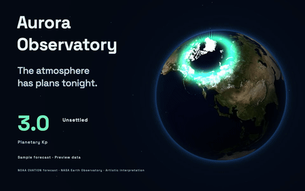</a><br>
      <strong>Aurora Observatory</strong><br><sub>NOAA space weather shapes auroral curtains around a 3D Earth. NASA Earth Observatory imagery; an artistic interpretation.</sub>
    </td>
  </tr>
</table>

- **A date to look forward to:** GTA VI counts calendar days in your time zone toward the console release date stored in its template. See [Rockstar's announcement](https://www.rockstargames.com/VI) for the current date.
- **Public space weather:** Aurora Observatory fetches [NOAA's OVATION forecast](https://www.swpc.noaa.gov/products/aurora-30-minute-forecast) and planetary Kp readings without account setup. Earth imagery comes from [NASA Earth Observatory](https://science.nasa.gov/earth/earth-observatory/blue-marble-next-generation/).
- **Mac data:** CPU load, memory estimates, and battery information can drive a scene.
- **Local activity:** optional Claude and Codex connections show session metadata; lifecycle hooks let a wallpaper react to work and approval states.
- **Public GitHub data:** connect a username to bring repositories, followers, and recent public events into the scene.
- **Your own input:** import a background or connect local JSON/JSONL snapshots. Developers can extend the data providers and wallpaper templates.

Connections live in **Data & settings**. Grok's hot takes and the racing scene's laps are playful wallpaper-session counters, not service usage or live race telemetry.

## How it started

I started by trying to bring the iPhone Duo effects to the Mac. I wanted that same sense of movement, but tied to something you could physically do with the laptop. Playing with the MacBook's sensors led to using the lid angle to drive the transition.

Then I added more effects. A blur became curtains, image reveals, flowing ribbons, and little characters peeking at the desktop. Apparently, closing a laptop needed art direction.

Once the rendering was there, I wanted to build a live wallpaper engine with real data behind it. CPU load could move a sculpture. Local coding activity could animate a robot. A public GitHub profile could become a city. That grew into the wallpaper collection, with separate templates and data sources so the next idea wouldn't require rebuilding everything.

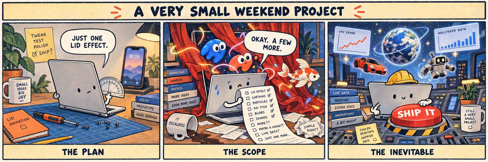

## Native, down to the pixels

Swift 6, SwiftUI, AppKit, and Apple's Metal APIs do the work. The curtains are lit cloth meshes; the ribbons, characters, and wallpaper worlds run through GPU shaders. The GIFs above come from those same renderers.

| Apple stack | What it does here |
| --- | --- |
| **Swift 6.2+ & SwiftUI** | App state, settings, the effect library, and wallpaper typography. |
| **AppKit** | Native windows, Dock and menu-bar controls, and desktop surfaces across displays. |
| **Metal & MetalKit** | Custom GPU pipelines for blur, cloth, image reveals, characters, and procedural wallpapers. |
| **IOKit** | Read-only access to the MacBook's lid-angle HID report. |
| **ScreenCaptureKit** | In-memory desktop frames for Frost's live blur. |

The Swift package has **zero third-party package dependencies**. Your GPU does get a slightly more theatrical job description.

## Get started

### Drag, drop, done

The release is a **Developer ID-signed, Apple-notarized DMG**, with an UnfoldMyMac-branded installation window and an Applications shortcut. It needs an **Apple silicon** Mac running **macOS 26 or later**; there is no Intel build.

1. Download the DMG from [GitHub Releases](https://github.com/satyajiit/UnfoldMyMac/releases/latest).
2. Open it and drag **UnfoldMyMac** onto **Applications**.
3. Launch UnfoldMyMac from Applications.

Releases are packaged, notarized, and published **manually**. GitHub Actions checks builds and tests; publishing stays behind a human-operated button.

### Build from source

You need **macOS 26 or later** and **Xcode 26 or later** with Swift 6.2+. Select Xcode's command-line tools in Xcode → Settings → Locations.

```sh
git clone https://github.com/satyajiit/UnfoldMyMac.git
cd UnfoldMyMac/MacDuo
./script/build_and_run.sh
```

The script builds and opens `MacDuo/dist/UnfoldMyMac.app`. It uses an available Apple Development signing identity or falls back to ad-hoc signing. You can copy the app to `/Applications` after building.

1. Open **Effects** and choose a design.
2. Try **Preview** to play or scrub it on your desktop.
3. Turn on lid effects. Use **Effect settings** to adjust the activation angle and completion point.

Lid control needs a MacBook with a readable lid-angle sensor. The app uses an undocumented Apple HID report, so support varies by model. Run `cd MacDuo && ./script/build_and_run.sh --probe` from a clone to check your Mac. Manual preview remains available when the sensor is missing, subject to built-in display safety checks.

Lid effects target the built-in display and pause when it is closed, asleep, unavailable, or mirrored. Wallpapers can use external displays.

<details>
<summary><strong>Permissions and data</strong></summary>

Frost needs **Screen Recording** to blur your desktop. Capture starts when you enable Frost or preview it, and stops when you switch away. Frames stay in memory; Frost does not save or transmit them. Other lid effects do not need Screen Recording.

Personal data connections are optional. Local activity sources read metadata from the files you select; lifecycle connections require their setup step. GitHub wallpapers fetch public profile data and avatars over the network. Aurora Observatory fetches public NOAA forecasts and geomagnetic readings when previewed or active, without account setup. Its cache refreshes every five minutes. The GTA VI countdown uses your local calendar and a bundled release date. Custom HTTP providers contact their configured endpoint.

Artwork imports are stored in `~/Library/Application Support/UnfoldMyMac/Artwork/`. Removing an import deletes the app's copy and leaves your original file alone.

</details>

## Contributing

[Bug reports](https://github.com/satyajiit/UnfoldMyMac/issues/new/choose), hardware compatibility reports, new effects, wallpapers, artwork, and fixes are welcome. [CONTRIBUTING.md](CONTRIBUTING.md) has the four checks to run before a pull request, the file map, and the rules on dependencies and artwork rights. [CODE_OF_CONDUCT.md](CODE_OF_CONDUCT.md) applies here. Security problems go through [SECURITY.md](SECURITY.md) rather than the issue tracker.

## Contributors

Everyone who helps build UnfoldMyMac is credited through their [commits](https://github.com/satyajiit/UnfoldMyMac/graphs/contributors) and [pull requests](https://github.com/satyajiit/UnfoldMyMac/pulls).

## License

Licensed under [Apache 2.0](LICENSE).

Space Grotesk retains its SIL Open Font License. Third-party product marks retain their owners' rights. See [NOTICE](NOTICE) for credits and sources.
