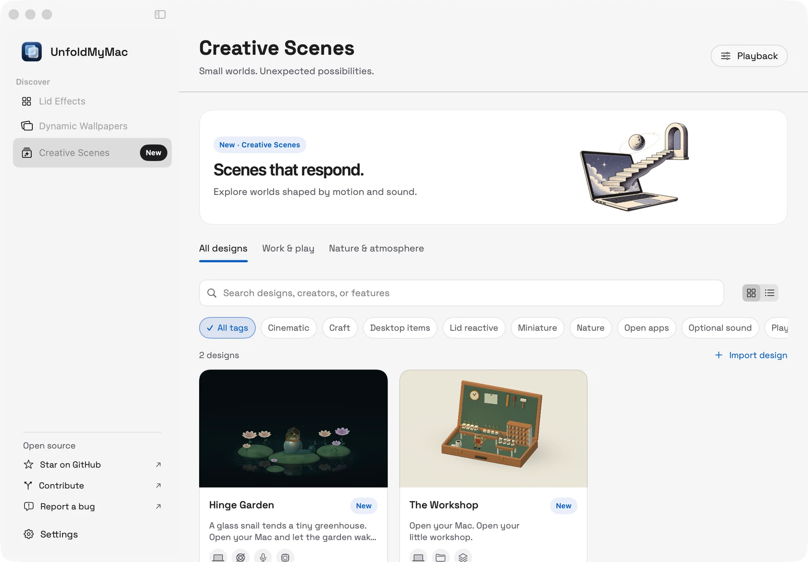

# UnfoldMyMac

Three collections: **Lid Effects**, **Dynamic Wallpapers**, and **Creative Scenes**, plus your own image art. Creative Scenes includes **Hinge Garden** and **The Workshop**. Native macOS 26+, SwiftUI/AppKit, and Metal. No third-party dependencies.

Open **Dynamic Wallpapers** for Pulse, Claude Current, Daydream, Codex Foundry, Grok Event Horizon, GitHub After Hours, Codex Mission Control, Lights Out, GTA VI — Vice City Countdown, and Aurora Observatory. Browse category tabs and tag filters in a grid or list. Cards identify related brands and capabilities; each design opens into a full detail page with a description, linked author credits, and the actual design preview. The name, short description, and usage badges appear above the preview; **Preview**, **Use wallpaper**, and **Customize** follow below. The title collapses into the native toolbar on scroll. Required setup opens before applying a design. **Playback** contains shared preferences. Codex hooks require a one-time review in Codex `/hooks`.

Open **Creative Scenes** for **Hinge Garden**. The snail emerges and retreats with the lid. Connecting a charger during playback sends a nine-second pulse through the pool, roots, shell, and greenhouse lantern, then leaves a soft glow while external power stays connected. Battery, local daylight, and CPU readings also shape the scene. **Customize** separates Motion, Sound, and One-liners. Pointer parallax, supported tilt/gyroscope input, and microphone reactions are optional. Audio is measured locally, never recorded or transcribed. Reduce Motion keeps the garden still and pauses sound reactions. The design page offers **Use scene** below its preview.

The discovery UI uses comic collection artwork that works in light and dark mode, visible filter chips, and an accessible New badge. Shared, versioned content metadata describes collections, categories, tags, authors, brands, features, and editorial sections without changing the renderer or breaking legacy templates. Templates and providers remain independently extensible; see [the engine guide](WALLPAPER_ENGINE.md) and [DEVELOPING.md](DEVELOPING.md).

**The Workshop** is a warm miniature studio inside a hinged wooden case. Open apps light up to twelve tool stations; an optional Desktop or chosen-folder connection fills up to twenty-four parcel slots. Native captions show the full counts. Finder, this app, helpers, and hidden folder items are excluded. Folder enumeration is shallow and never reads file contents. The case folds with your lid; the maker gently shifts weight and turns a crank as the front tools move. Eight original motivating lines fade between one another every forty-five seconds, with an independent toggle in Customize. Local daylight, pointer parallax, and a charging accent bring the studio to life. **Customize** offers count visibility, mirroring, and the optional folder connection. Reduce Motion holds an open pose with live counts.



```sh
./script/build_and_run.sh
```

The build produces `dist/UnfoldMyMac.app`. Open **Lid Effects** to choose a design, preview any card, and turn lid effects on or off. Its header shows the selected design and an **Effect settings** action for lid timing, menu-bar angle, Screen Recording, and diagnostics. Use Back to return to the library. The large heading and controls scroll away, leaving only a compact page title in the native toolbar; scrolling to the top restores them. App-wide **Settings**, at the bottom of the sidebar, contains appearance, accessibility status, and app information. Each card has a full artwork cover, selection button, Preview action, and Adjust control. Preview plays directly on your desktop with floating Play/Pause, slider, and Stop controls; it keeps your chosen effect unchanged. Stop restores the previous enabled state. With Reduce Motion, preview starts in manual mode. UnfoldMyMac appears in the Dock and app switcher. Closing its window keeps the Dock icon and menu-bar controls available; click the Dock icon to reopen it.

| Effect | Rendering | Permission |
| --- | --- | --- |
| Frost | Screen-aligned live desktop, progressive Metal blur and darkening | Screen Recording |
| Veil | Native behind-window material with graduated coverage | None |
| Fade | Native graduated darkening | None |
| Curtains | Two deforming 3D velvet panels, stage lighting, pleats, and soft edge shadows | None |
| Reverie | Generated celestial paper art with a curved split, depth, and gold edge light | None |
| Neon Coast | Original GTA VI-inspired coastal game art with an angled split and neon edge light | None |
| Rise | Motivational illustrated poster with an energetic split and warm edge light | None |
| Current | Flowing luminous ribbons and drifting particles | None |
| Peekaboo | Glossy 3D character shutters with blinking eyes and wandering pupils | None |
| Tab Goblin | A weary Mac says “BRO. CLOSE A TAB.” in a comic-style image reveal | None |
| FCUK It. Ship It. | Orange-and-cobalt attitude, a cursor-riding Mac, and an angled image reveal | None |
| Codex After Dark | Neon pixel-art bug chase: “ONE MORE FIX.” with a diagonal reveal | None |
| Claude Has Notes | Warm paper-art revision mountain: “JUST ONE SMALL CHANGE.” with a sculpted reveal | None |

Find **Codex After Dark** and **Claude Has Notes** under Image Art with the **Coding** tag. Both use the existing image renderer and can use any reveal preset. Both ship as original generated artwork.

**Curtains** closes horizontally from both sides, then gathers away as you reopen the lid. Its centre opening reveals the real desktop. At 80% lid travel (the default calibration), the panels fully overlap and hold the closed fabric pose. **Fold depth** adjusts the sculpted pleats while keeping the fabric opaque. The same motion can be scrubbed or played in Preview.

**Reverie**, **Neon Coast**, **Rise**, and imported images separate two complementary artwork panels to reveal the real desktop. Closing the lid reassembles the complete image; the existing 80% calibration applies. **Depth & edge light** adjusts foreshortening, offset, and edge illumination. Choose Sculpted, Diagonal, Slide, or Burst independently for every image in **Adjust**. Artwork ships with the app as generated PNGs; there is no runtime image-generation service.

Frost keeps desktop landmarks at their original scale. Its blur follows the iPhone Duo reference: up to 72 source pixels, a 1.35 spatial exponent, a 0.2 darkening dead zone, 2× darkening, and a 5×5 binomial kernel. The reference projects UI onto moving phone geometry. A stationary fullscreen effect must use identity texture coordinates instead of copying the projection onto a rectangle. A continuous subpixel blend prevents an activation seam at the image edge.

Frost captures only the exact built-in display and requires successful exclusion of UnfoldMyMac's process. Applied wallpaper windows are explicitly included so Frost can blur them, while the app's controls and effect overlays remain excluded. Frames stay in memory; no audio or network. Capture starts only after explicitly enabling Frost or starting its preview. Denial presents a Settings link; UnfoldMyMac never opens privacy settings automatically. Changing away from Frost stops capture. Veil is a system-controlled material, not an exact variable-radius Gaussian blur.

Effects pause for a closed/asleep, unavailable, or mirrored built-in display. They never target an external display. The effect ignores mouse input. Preview has a floating Stop/slider panel above it, and stops when you close/minimize the main window, choose a design, or open effect settings or app Settings. Escape stops preview when its controls or main window have keyboard focus. Missing lid hardware permits manual preview, but never bypasses physical clamshell/display safety.

The default activation is 125° (adjustable 60–180° in whole degrees). The effect begins on the first frame reporting that angle and clears as soon as the reading rises above it. Live input is sampled immediately before rendering, without a smoothing delay. **Finish effect by** defaults to 80% of lid travel, so the complete animation arrives sooner and holds for the final 20%. Adjust it from 40–100%; **Effect settings** shows the corresponding physical lid angle. Manual preview applies the same completion calibration. **Use current angle** anchors it to your current position. Effects start disabled on launch. Reduce Motion disables automatic playback; manual/lid input still works. Reduce Transparency uses a dim-only effect without capture.

**Lid Effects** groups designs into **Glass & Light**, **Image Art**, and **Motion & 3D**, with cover thumbnails and author credits. Search titles, tags, and authors; use visible tag chips for Game Art, Motivation, Energetic, Calm, and more. **Add image** imports a local image into Image Art. UnfoldMyMac keeps its own copy, so moving the original does not break the design. Adjust separates appearance controls from details and credits. For imports, rename the design, credit its author, change the reveal, or remove UnfoldMyMac’s copy. Imports accept supported images up to 50 MB and 200 MP, normalized to a 4096-pixel maximum; animated formats use the first frame. Covers are illustrative—Preview shows the rendered effect.

**Current** keeps moving while the lid holds still. Play a preview to see its ribbons and sparks; pausing freezes the frame. Reduce Motion stills this flow. **Rise** uses new generated “MAKE IT HAPPEN” artwork, with sunburst rays and cobalt steps.

The interface uses bundled **Space Grotesk**, a centralized SF Symbols icon vocabulary, compact artwork cards, and a native enable switch. A shared blue and neutral palette connects the sidebar and content. The generated optical-glass logo is bundled as PNG and a full-resolution macOS app icon.

**Peekaboo** adds two rounded orange/violet 3D shutters with four sphere-mesh eyes. Their faces breathe, blink, and glance around while active. **Playfulness** controls their motion; zero keeps the faces still. Pausing Preview freezes the pose, and Reduce Motion stops the character animation. **Tab Goblin** and **FCUK It. Ship It.** join Image Art with Humor and Mac tags.

Primary actions use white labels on an opaque blue surface, with tested contrast of 6.34:1 in Light and 4.81:1 in Dark. Secondary actions use explicit primary text on native glass, with an opaque fallback for Reduce Transparency. Shared button styling prevents inherited tint from turning labels cyan.

## Development

```sh
swift test
./script/build_and_run.sh --build
./script/build_and_run.sh --shader-check
./script/build_and_run.sh --probe
```

`--self-test` runs the test suite. The package contains `UnfoldMyMacCore` (models/math/preferences), `UnfoldMyMacKit` (application, effects, platform services, presentation), and `UnfoldMyMac` (entrypoint). See [DEVELOPING.md](DEVELOPING.md) for extending effects and [VALIDATION.md](VALIDATION.md) for checks and limitations.

`UNFOLDMYMAC_SIGN_IDENTITY` selects a signing identity; the legacy `LUMA_SIGN_IDENTITY` and `MACDUO_SIGN_IDENTITY` overrides also work. Otherwise the script uses an existing Apple Development identity, falling back to ad-hoc signing. Bundle identifier `com.unfoldmymac` is signed from Info.plist. macOS may request Screen Recording again after an identifier change. Legacy style and activation preferences migrate automatically; Clay maps to Veil and other old styles map to Frost. 
